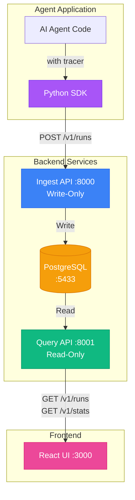

# Agent Observability Platform - Documentation

Welcome to the technical documentation for the Agent Observability Platform (Phase 1).

## Overview

The Agent Observability Platform is a privacy-by-default telemetry system for AI agents. It captures structured execution traces, step timelines, and semantic failure classifications without storing sensitive data like prompts, responses, or PII.

## Documentation Structure

### Architecture & Design

- **[Architecture](./architecture.md)** - System architecture, components, and technology stack
- **[Component Responsibilities](./component-responsibility.md)** - Separation of concerns and clear boundaries
- **[Data Flow](./data-flow.md)** - How telemetry flows through the system

### Features & Capabilities

- **[Failure Handling](./failure-handling.md)** - Failure taxonomy, classification, and retry modeling
- **[API Sequences](./api-sequences.md)** - Detailed interaction sequences for API operations

### Operations

- **[Deployment](./deployment.md)** - Docker architecture and deployment guide

## Quick Navigation

### For Developers
- Understanding the codebase: Start with [Architecture](./architecture.md)
- Adding instrumentation: See [Data Flow](./data-flow.md)
- Handling failures: Read [Failure Handling](./failure-handling.md)
- API integration: Check [API Sequences](./api-sequences.md)

### For DevOps
- Deployment setup: See [Deployment](./deployment.md)
- Component boundaries: Review [Component Responsibilities](./component-responsibility.md)

### For Product/Security
- Privacy enforcement: See privacy sections in [Data Flow](./data-flow.md)
- System capabilities: Review [Architecture](./architecture.md)

## Key Principles

### 1. Privacy by Default
- No prompts, responses, or chain-of-thought stored
- No PII or sensitive user data
- Privacy validation at multiple layers (SDK, API, Database)

### 2. Separation of Concerns
- **Read/Write API Separation**: Query API (read-only) and Ingest API (write-only)
- **Layer Isolation**: UI → API → Data → SDK
- **Single Responsibility**: Each component has clear, focused responsibilities

### 3. Fail-Safe Operation
- SDK never crashes the agent
- Idempotent ingestion (duplicate runs handled gracefully)
- Proper error handling at all layers

### 4. Observable & Debuggable
- Structured logging throughout
- Health check endpoints
- Metrics collection (Phase 1: simple counters)

## Component Overview

## Technology Stack

| Layer | Technology | Purpose |
|-------|-----------|---------|
| Frontend | React + TypeScript + Vite | Modern UI framework |
| Styling | Tailwind CSS | Utility-first CSS |
| API | FastAPI + Python 3.10 | High-performance REST APIs |
| ORM | SQLAlchemy + Pydantic | Type-safe database models |
| Database | PostgreSQL 15 | Relational data storage |
| SDK | Python + httpx | Client instrumentation |
| Deployment | Docker Compose | Multi-container orchestration |

## Phase 1 Scope

### Implemented Features
- ✅ Privacy-by-default telemetry capture
- ✅ Ordered step timeline reconstruction
- ✅ Semantic failure classification
- ✅ Retry modeling (each retry as separate step)
- ✅ Read/Write API separation
- ✅ Idempotent ingestion
- ✅ React dashboard with filtering
- ✅ Docker deployment
- ✅ Health checks and metrics

### Future Enhancements (Phase 2+)
- ⏭ Advanced search and filtering
- ⏭ Real-time updates (WebSocket)
- ⏭ Alerting and notifications
- ⏭ Multi-language SDK support
- ⏭ Distributed tracing correlation
- ⏭ Advanced analytics and insights

## Getting Started

1. **Quick Start**: See `../QUICK_START.md` for setup instructions
2. **Architecture**: Read [Architecture](./architecture.md) for system overview
3. **SDK Usage**: Check `../examples/customer_support_agent.py` for instrumentation examples
4. **API Reference**: Review [API Sequences](./api-sequences.md) for endpoint details

## Contributing

When adding new features:
1. Review [Component Responsibilities](./component-responsibility.md) for boundaries
2. Follow privacy principles outlined in [Data Flow](./data-flow.md)
3. Update failure taxonomy in [Failure Handling](./failure-handling.md) if adding new failure types
4. Update relevant documentation diagrams

## Support

- Issues: File at project repository
- Questions: Review documentation first, then ask in discussions
- Security: See privacy enforcement sections in documentation
