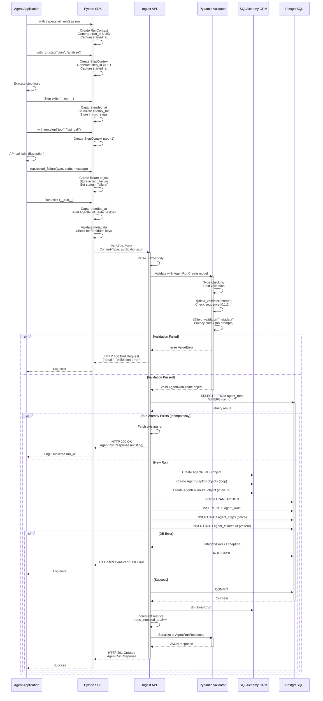
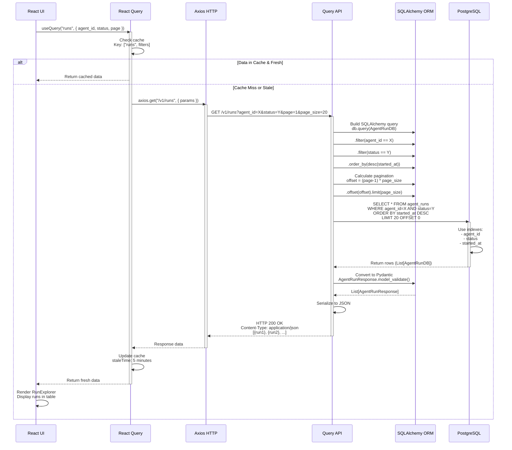
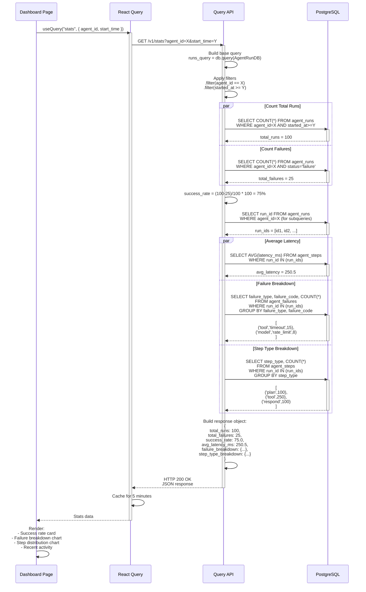
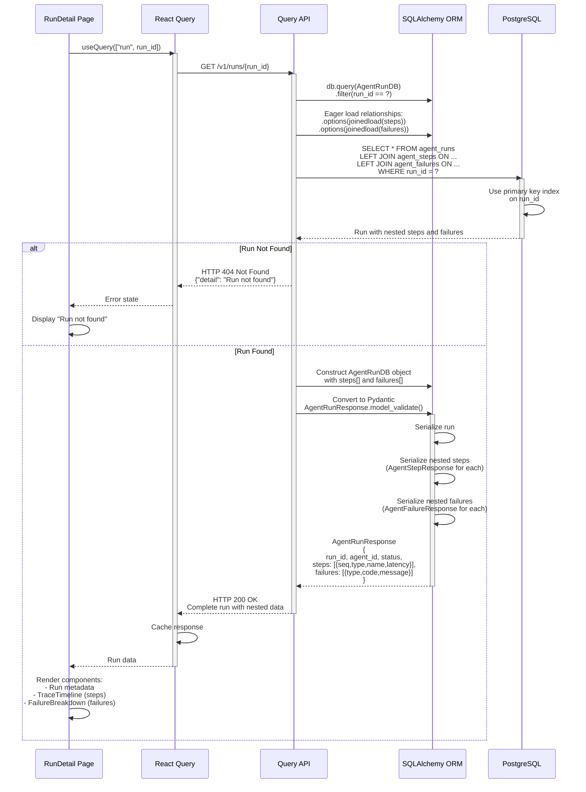
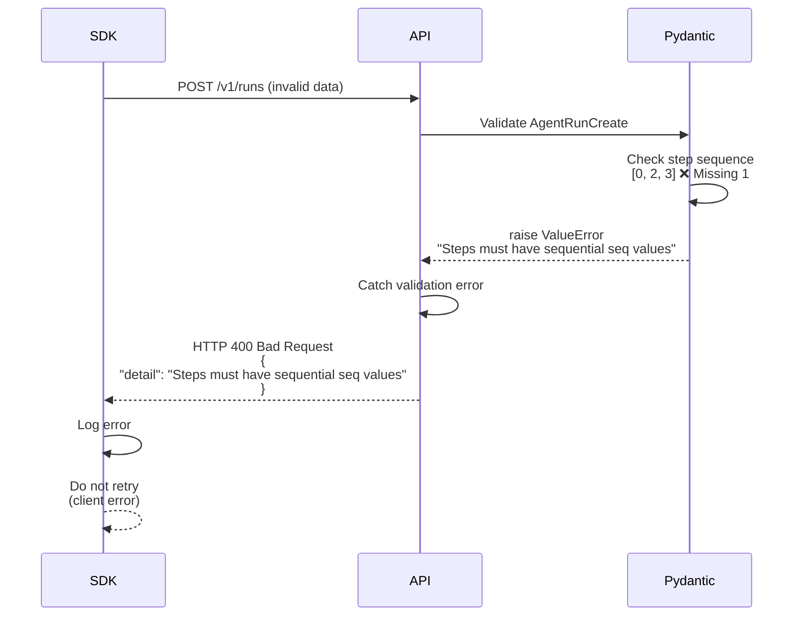
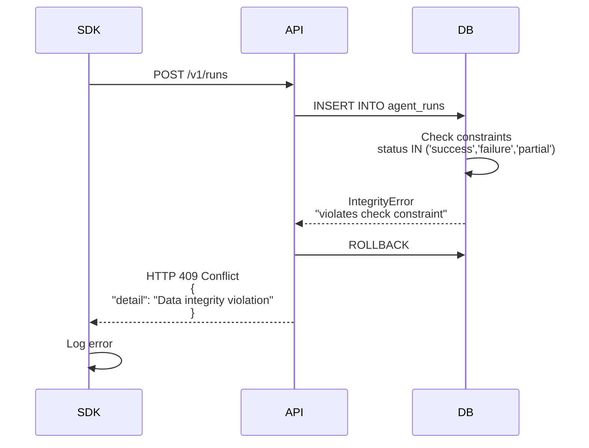
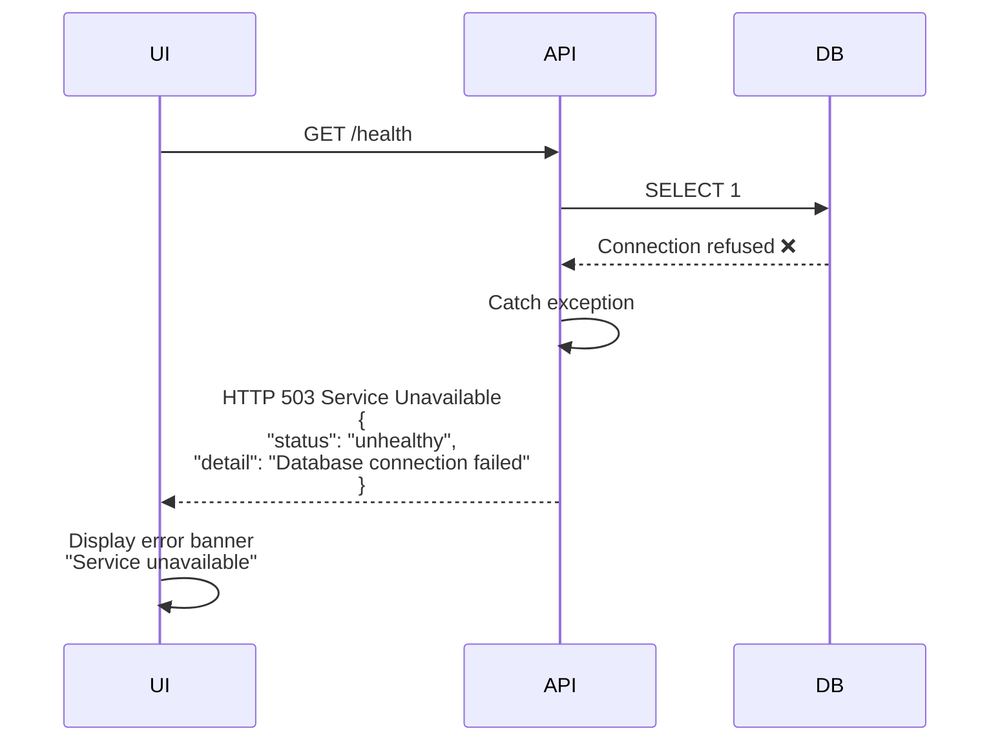
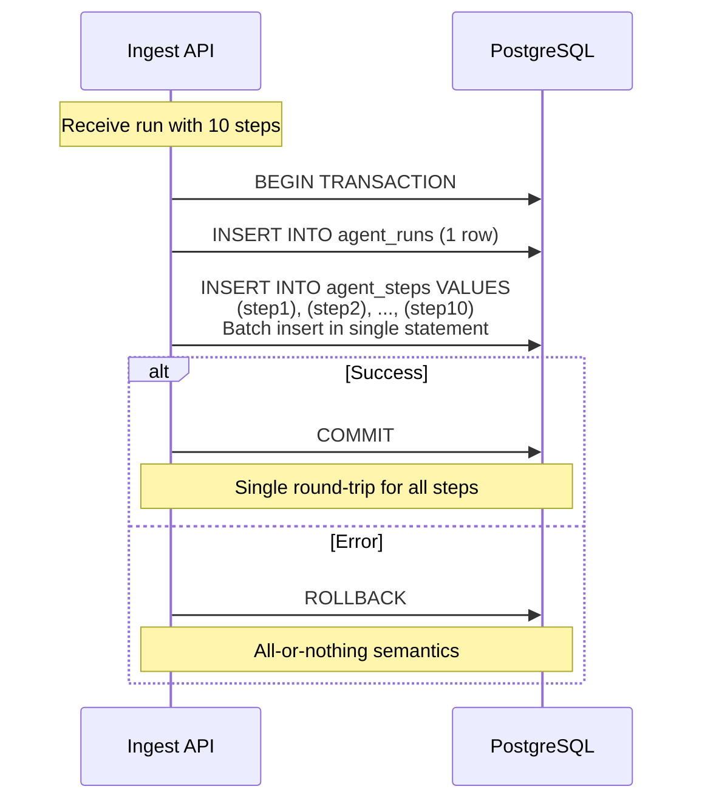
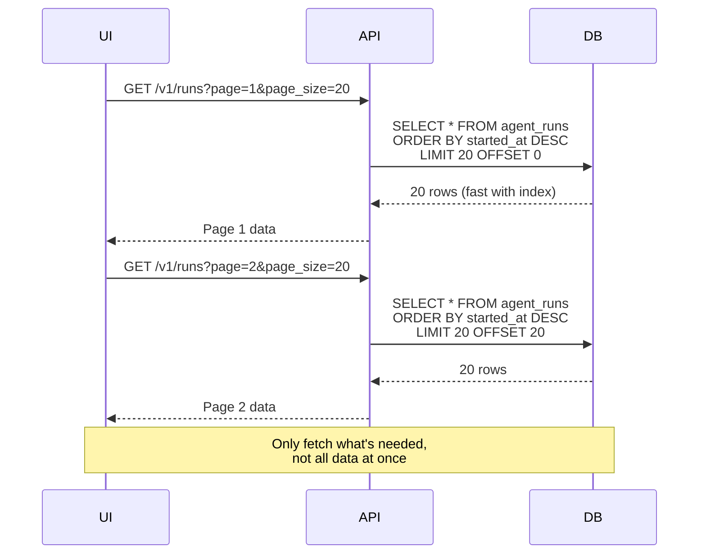

# API Sequence Diagrams

This document provides detailed sequence diagrams for all API operations in the AgentTracer Platform.

## Table of Contents
- [Run Ingestion Sequence](#run-ingestion-sequence)
- [Run Query Sequence](#run-query-sequence)
- [Stats Aggregation Sequence](#stats-aggregation-sequence)
- [Run Detail Sequence](#run-detail-sequence)

---

## Run Ingestion Sequence

Complete sequence for ingesting an agent run via the Ingest API.

### Key Points

1. **Timing Capture**: SDK automatically captures timestamps via context managers
2. **Validation Layers**: SDK → Pydantic → Database constraints
3. **Idempotency**: Duplicate `run_id` returns existing run (HTTP 200)
4. **Transactional**: Single transaction for run + steps + failures
5. **Failure Handling**: Validation errors return HTTP 400, DB errors return HTTP 409/500

---

## Run Query Sequence

Sequence for querying runs with filters via the Query API.

### Key Points

1. **Client Caching**: React Query caches for 5 minutes to reduce API calls
2. **Filtering**: Multiple filters can be combined (agent_id, status, environment, time range)
3. **Pagination**: Offset/limit pattern, page-based
4. **Indexing**: Uses database indexes for fast WHERE clauses
5. **Serialization**: ORM objects → Pydantic → JSON

---

## Stats Aggregation Sequence

Sequence for fetching aggregated statistics for the Dashboard.

### Key Points

1. **Parallel Queries**: Multiple aggregations run in parallel for performance
2. **Subquery Pattern**: Get run_ids first, then aggregate related data
3. **GROUP BY**: Aggregates failures by type/code, steps by type
4. **Calculation**: Success rate calculated in Python (could be done in SQL)
5. **Caching**: Results cached for 5 minutes

---

## Run Detail Sequence

Sequence for fetching a single run with all steps and failures.

### Key Points

1. **Eager Loading**: Single query fetches run + steps + failures (prevents N+1)
2. **Relationships**: SQLAlchemy `joinedload` loads related data
3. **Nested Serialization**: Pydantic serializes nested lists automatically
4. **Not Found Handling**: Returns HTTP 404 if run doesn't exist
5. **Rich Response**: Complete run data for detailed view

---

## Error Handling Sequences

Common error scenarios and their handling.

### Validation Error (HTTP 400)

### Database Constraint Error (HTTP 409)

### Database Connection Error (HTTP 503)

---

## Performance Optimization Patterns

### Batch Insert Pattern (Ingest API)

### Pagination Pattern (Query API)

---

## Next Steps

- Review [Data Flow](./data-flow.md) for end-to-end flow context
- See [Failure Handling](./failure-handling.md) for failure capture sequences
- Check [Component Responsibilities](./component-responsibility.md) for layer boundaries
