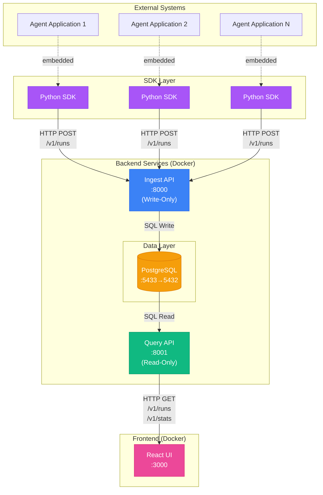
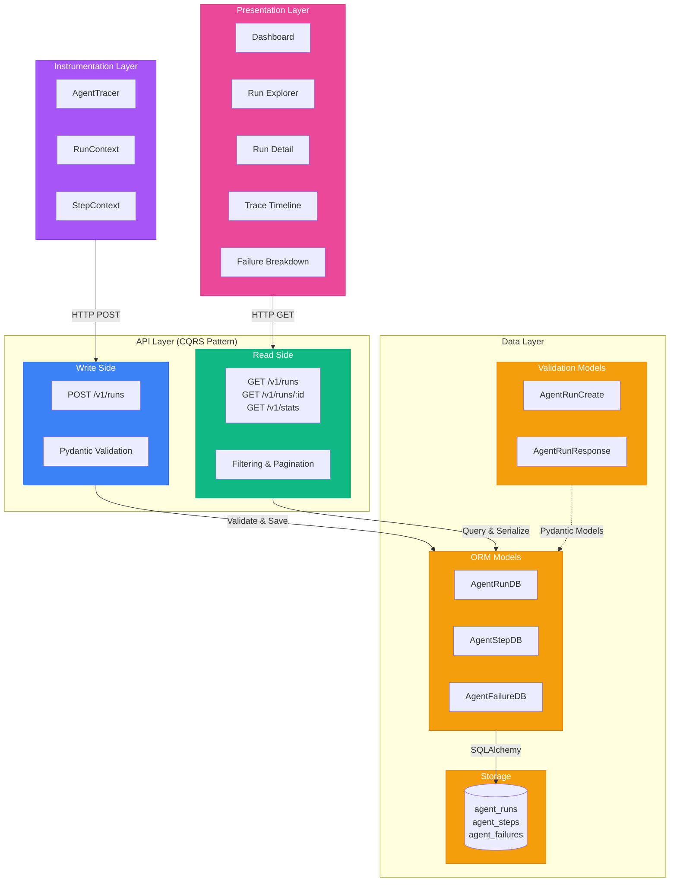
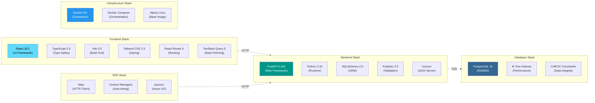
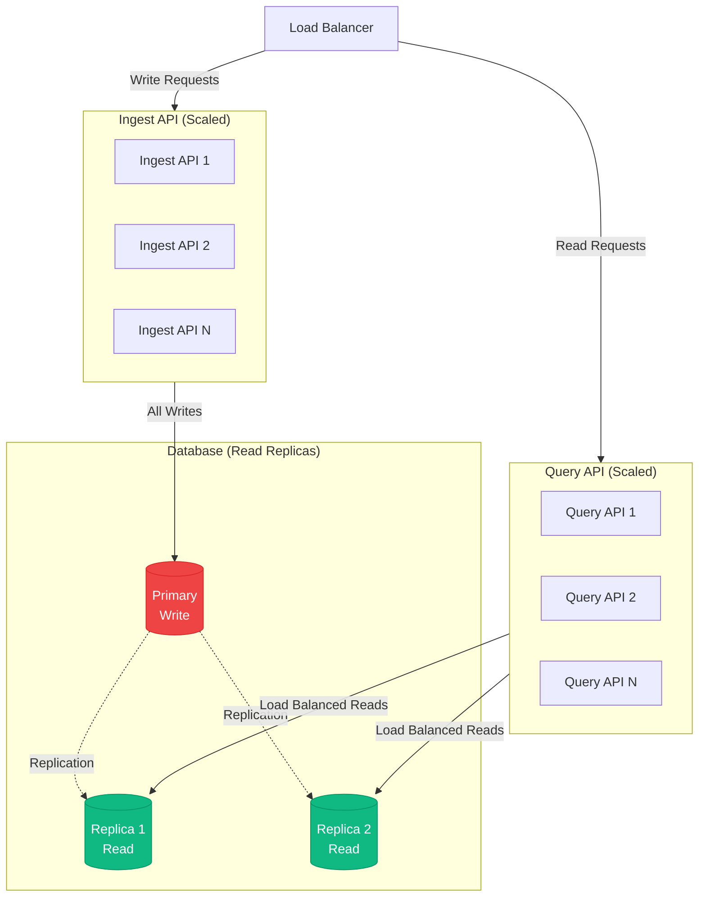
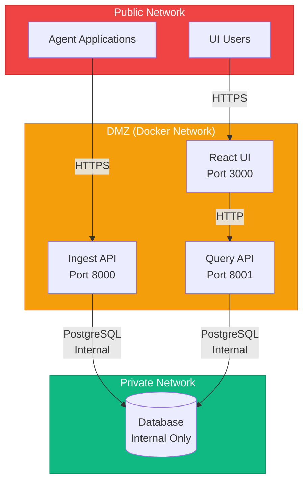

# System Architecture

This document describes the architecture of the Agent Observability Platform, showing how components interact and responsibilities are distributed.

## Table of Contents
- [Component Architecture](#component-architecture)
- [Layer Architecture](#layer-architecture)
- [Technology Stack](#technology-stack)
- [Component Details](#component-details)

---

## Component Architecture

The system follows a microservices-inspired architecture with clear separation between read and write operations.



### Key Design Decisions

1. **Read/Write Separation**: Ingest and Query APIs are separate services for scalability and security
2. **Stateless APIs**: Both APIs are stateless, allowing horizontal scaling
3. **Embedded SDK**: SDK runs within agent process, no separate service needed
4. **Single Database**: PostgreSQL handles both writes and reads (Phase 1 simplicity)

---

## Layer Architecture

The system is organized into distinct layers with clear responsibilities and boundaries.



### Layer Responsibilities

| Layer | Responsibilities | Technology |
|-------|-----------------|------------|
| **Presentation** | User interaction, visualization, client-side filtering | React + TypeScript |
| **API (Write)** | Validation, idempotency, privacy enforcement, writes | FastAPI + Pydantic |
| **API (Read)** | Querying, filtering, pagination, aggregation, reads | FastAPI + SQLAlchemy |
| **Data (ORM)** | Object-relational mapping, relationships, constraints | SQLAlchemy |
| **Data (Validation)** | Input validation, output serialization, type safety | Pydantic |
| **Data (Storage)** | Persistence, indexing, transactions, constraints | PostgreSQL 15 |
| **Instrumentation** | Timing capture, context management, privacy filtering | Python SDK |

---

## Technology Stack

Detailed mapping of technologies to architectural components.



### Technology Choices Rationale

**Frontend:**
- **React 18.2**: Industry standard, excellent ecosystem, concurrent features
- **TypeScript**: Type safety prevents runtime errors, better IDE support
- **Vite**: Fast HMR, modern build tool, optimized for development
- **Tailwind CSS**: Utility-first, rapid prototyping, small bundle size

**Backend:**
- **FastAPI**: High performance, automatic OpenAPI docs, async support
- **Pydantic**: Runtime validation, type coercion, serialization
- **SQLAlchemy 2.0**: Mature ORM, excellent PostgreSQL support
- **Python 3.10**: Modern Python features, type hints, pattern matching

**Database:**
- **PostgreSQL 15**: ACID compliance, JSON support, powerful indexing
- **Alpine Linux**: Minimal attack surface, small image size

**SDK:**
- **httpx**: Modern HTTP client, async support, HTTP/2
- **Context Managers**: Pythonic, automatic resource cleanup

---

## Component Details

### 1. Python SDK (AgentTracer)

**Location:** `sdk/agenttrace.py`

**Purpose:** Embedded library for capturing agent telemetry from within the agent process.

**Key Classes:**
- `AgentTracer`: Main entrypoint, configures connection to Ingest API
- `RunContext`: Manages a single agent run, tracks steps and failures
- `StepContext`: Captures timing for individual steps

**Responsibilities:**
- Automatic step timing via context managers
- Privacy enforcement (metadata validation)
- Fail-safe operation (never crashes agent)
- Async batched delivery to Ingest API

**Example:**
```python
tracer = AgentTracer(
    agent_id="my_agent",
    agent_version="1.0.0",
    api_url="http://localhost:8000"
)

with tracer.start_run() as run:
    with run.step("plan", "analyze_query"):
        # Agent logic here
        pass
```

---

### 2. Ingest API (Write-Only)

**Location:** `backend/ingest_api.py`

**Port:** 8000

**Purpose:** Write-only API for ingesting agent telemetry with strict validation.

**Key Endpoints:**
- `POST /v1/runs`: Ingest complete run with steps and failures
- `GET /health`: Health check
- `GET /metrics`: Internal metrics (Phase 1: simple counters)

**Responsibilities:**
- Schema validation (Pydantic)
- Idempotency via `run_id` (duplicate detection)
- Privacy enforcement (reject sensitive data)
- Transactional writes (atomicity)
- Fast writes (<200ms p99 target)

**Validation Layers:**
1. Pydantic schema validation
2. Privacy validators (no prompts/responses)
3. Business rules (step sequencing, failure requirements)
4. Database constraints (foreign keys, checks)

---

### 3. Query API (Read-Only)

**Location:** `backend/query_api.py`

**Port:** 8001

**Purpose:** Read-only API for querying runs with filtering and aggregation.

**Key Endpoints:**
- `GET /v1/runs`: List runs with filters and pagination
- `GET /v1/runs/{run_id}`: Get specific run with steps/failures
- `GET /v1/runs/{run_id}/steps`: Get ordered steps for a run
- `GET /v1/runs/{run_id}/failures`: Get failures for a run
- `GET /v1/stats`: Aggregated statistics
- `GET /health`: Health check

**Responsibilities:**
- Efficient queries with filtering
- Pagination support
- Aggregation for statistics
- No mutations (read-only guarantee)
- Response serialization

**Performance Features:**
- Indexed queries (agent_id, status, environment, timestamps)
- Pagination to limit data transfer
- Eager loading for relationships (steps, failures)

---

### 4. Database (PostgreSQL)

**Location:** Docker container `agent_observability_db`

**Port:** 5433→5432

**Purpose:** Persistent storage with relational integrity.

**Schema:**
- `agent_runs`: Run metadata (agent_id, version, status, timestamps)
- `agent_steps`: Ordered steps (seq, type, latency, metadata)
- `agent_failures`: Semantic failures (type, code, message)

**Key Features:**
- Foreign keys with cascade delete
- CHECK constraints for data integrity
- Unique constraints (run_id, step sequence)
- B-Tree indexes for common queries
- JSONB for safe metadata storage

**Indexes:**
- `agent_runs`: agent_id, status, environment, started_at
- `agent_steps`: run_id, step_type, started_at
- `agent_failures`: run_id, failure_type

---

### 5. React UI

**Location:** `ui/` directory

**Port:** 3000

**Purpose:** User interface for visualizing agent runs and failures.

**Key Pages:**
- **Dashboard**: Overview statistics, recent activity
- **Run Explorer**: Searchable/filterable run list
- **Run Detail**: Individual run with timeline and failures

**Key Components:**
- `TraceTimeline`: Visual step timeline with retry detection
- `FailureBreakdown`: Semantic failure classification display
- `RunExplorer`: Filterable run list with pagination

**Data Flow:**
- React Query for data fetching and caching
- Axios for HTTP client
- 5-minute stale time for cache optimization

---

## Scalability Considerations

### Horizontal Scaling (Future)



**Phase 1:** Single instance of each service
**Phase 2+:** Horizontal scaling with load balancing

---

## Security Boundaries



**Security Layers:**
1. **Public**: Agent SDK and UI users (HTTPS in production)
2. **DMZ**: API and UI containers (Docker network isolation)
3. **Private**: Database (not exposed to public network)

---

## Next Steps

- Review [Data Flow](./data-flow.md) to understand how telemetry moves through the system
- See [Component Responsibilities](./component-responsibility.md) for detailed separation of concerns
- Check [Deployment](./deployment.md) for Docker architecture details
