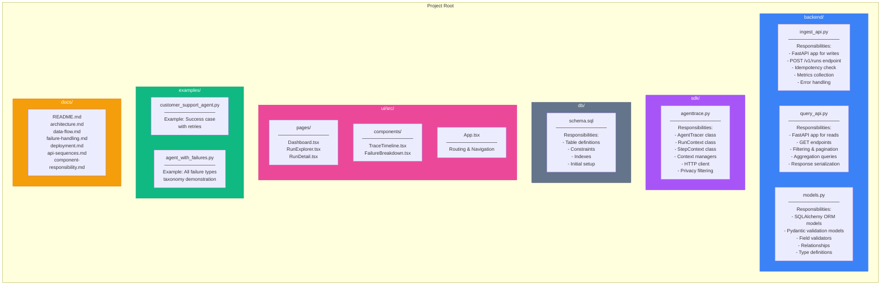
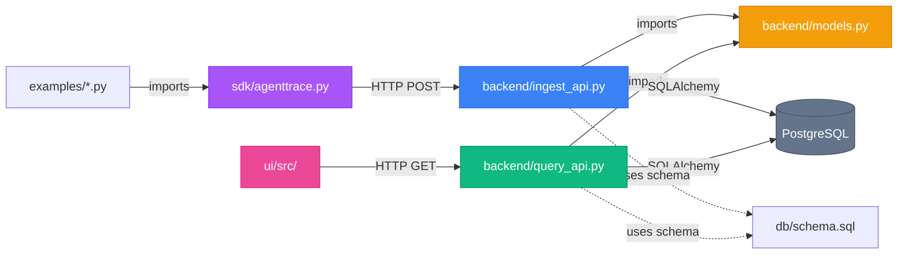
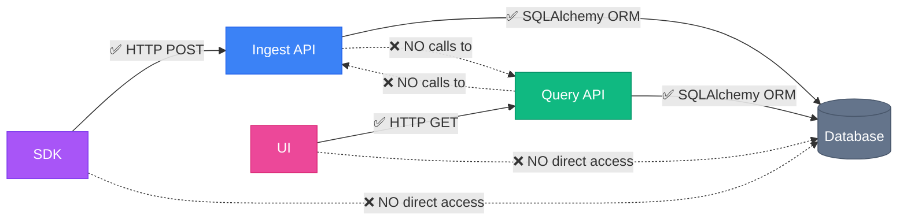

# Component Responsibilities & Separation of Concerns

This document defines clear boundaries and responsibilities for each component in the AgentTracer Platform.

## Table of Contents
- [Component Responsibility Matrix](#component-responsibility-matrix)
- [Data Validation Layers](#data-validation-layers)
- [Error Handling Boundaries](#error-handling-boundaries)
- [Privacy Enforcement Layers](#privacy-enforcement-layers)
- [Code Organization](#code-organization)

---

## Component Responsibility Matrix

Clear definition of what each component is responsible for.


### Responsibility Summary Table

| Component | Core Responsibilities | Forbidden Actions |
|-----------|----------------------|-------------------|
| **SDK** | Timing, sequencing, privacy check, HTTP POST | No validation, no DB, no retries |
| **Ingest API** | Validation, idempotency, privacy, writes | No reads, no filtering, no aggregation |
| **Query API** | Reads, filtering, pagination, aggregation | No writes, no validation, no privacy filtering |
| **Models** | Schema, validation, relationships, types | No business logic, no HTTP, no queries |
| **Database** | Persistence, constraints, indexes, transactions | No validation, no business rules |
| **UI** | Visualization, interaction, caching, routing | No validation, no DB access, no logic |

---

## Data Validation Layers

Multi-layer validation ensures data quality and privacy.

```mermaid
flowchart TD
    Start([Agent Captures Data]) --> Layer1

    subgraph Layer1["Layer 1: SDK Validation"]
        direction TB
        L1Check{Check Metadata Keys}
        L1Check -->|Forbidden| L1Reject[Filter out:<br/>prompt, response,<br/>input, output,<br/>content, text]
        L1Check -->|Allowed| L1Pass[Pass: tool names,<br/>HTTP codes,<br/>retry counts,<br/>numeric values]

        L1Responsibility["SDK Responsibility:<br/>✅ Client-side privacy<br/>✅ Basic key filtering<br/>✅ Log warnings<br/>❌ NOT comprehensive"]
    end

    L1Pass --> Layer2

    subgraph Layer2["Layer 2: Pydantic Validation"]
        direction TB
        L2Schema{Schema Validation}
        L2Schema --> L2Type[Type checking:<br/>UUID, datetime,<br/>int, str, dict]

        L2Type --> L2Fields{Field Validators}
        L2Fields --> L2Seq[@field_validator steps:<br/>Check [0,1,2...] sequence]
        L2Seq --> L2Meta[@field_validator metadata:<br/>Check for sensitive keys]
        L2Meta --> L2Time[@field_validator timing:<br/>ended_at >= started_at]
        L2Time --> L2Fail[@field_validator failure:<br/>status='failure' requires object]

        L2Fail --> L2Result{Validation Result}
        L2Result -->|Invalid| L2Reject[raise ValueError<br/>HTTP 400 Bad Request]
        L2Result -->|Valid| L2Pass[Pass to ORM]

        L2Responsibility["Pydantic Responsibility:<br/>✅ Comprehensive validation<br/>✅ Type coercion<br/>✅ Business rules<br/>✅ Privacy enforcement<br/>✅ Clear error messages"]
    end

    L2Pass --> Layer3

    subgraph Layer3["Layer 3: Database Constraints"]
        direction TB
        L3Constraints{Database Constraints}
        L3Constraints --> L3Check[CHECK constraints:<br/>status IN ('success','failure','partial')]
        L3Check --> L3FK[Foreign keys:<br/>run_id, step_id references]
        L3FK --> L3Unique[UNIQUE constraints:<br/>PRIMARY KEY run_id,<br/>UNIQUE (run_id, seq)]
        L3Unique --> L3NotNull[NOT NULL:<br/>required fields]

        L3NotNull --> L3Result{Constraint Check}
        L3Result -->|Violated| L3Reject[IntegrityError<br/>HTTP 409 Conflict]
        L3Result -->|Satisfied| L3Pass[Data persisted ✅]

        L3Responsibility["Database Responsibility:<br/>✅ Data integrity<br/>✅ Referential integrity<br/>✅ Uniqueness guarantee<br/>❌ NOT validation logic"]
    end

    L1Reject -.-> Sanitized[Sanitized data<br/>continues]
    Sanitized --> Layer2

    L2Reject --> Blocked([❌ Request Rejected])
    L3Reject --> Blocked

    L3Pass --> Safe([✅ Data Safe in Database])

    style Layer1 fill:#fef3c7,stroke:#ca8a04
    style Layer2 fill:#dbeafe,stroke:#3b82f6
    style Layer3 fill:#dcfce7,stroke:#16a34a
    style Blocked fill:#fee2e2,stroke:#dc2626
    style Safe fill:#d1fae5,stroke:#059669
```

### Validation Responsibility Breakdown

**Layer 1 (SDK):**
- **Purpose**: Client-side privacy check, early warning
- **Scope**: Basic forbidden key detection
- **Action**: Log warning, filter out sensitive keys
- **Fail Mode**: Continue with sanitized data

**Layer 2 (Pydantic):**
- **Purpose**: Comprehensive validation and business rules
- **Scope**: Types, sequences, timing, privacy, failure requirements
- **Action**: Raise `ValueError` with clear message
- **Fail Mode**: Reject request with HTTP 400

**Layer 3 (Database):**
- **Purpose**: Data integrity and referential integrity
- **Scope**: Constraints, foreign keys, uniqueness
- **Action**: Raise `IntegrityError`
- **Fail Mode**: Rollback transaction, HTTP 409

---

## Error Handling Boundaries

Each layer has specific error handling responsibilities.

```mermaid
graph TB
    subgraph SDKLayer["SDK Layer"]
        direction TB
        SDKErr1[Exception Type: Any]
        SDKErr2[Handling: try/except]
        SDKErr3[Action: Log error,<br/>do NOT crash agent]
        SDKErr4[User Impact: Silent failure,<br/>telemetry lost]
        SDKErr5[Retry: NO retry]

        SDKPolicy["Error Policy:<br/>NEVER crash the agent<br/>Log and continue<br/>Graceful degradation"]
    end

    subgraph APILayer["API Layer (Ingest & Query)"]
        direction TB
        APIErr1[Exception Types:<br/>ValueError Pydantic,<br/>IntegrityError DB,<br/>HTTPException,<br/>Generic Exception]

        APIErr2[Handling:<br/>try/except blocks<br/>per endpoint]

        APIErr3[Actions:<br/>400 → Validation error<br/>404 → Not found<br/>409 → Duplicate/constraint<br/>500 → Unexpected error<br/>503 → DB connection failed]

        APIErr4[Logging:<br/>logger.error with exc_info<br/>Include request context]

        APIErr5[User Impact:<br/>Clear HTTP status<br/>JSON error detail]

        APIPolicy["Error Policy:<br/>Proper HTTP codes<br/>Detailed error messages<br/>Log everything<br/>Rollback transactions"]
    end

    subgraph DBLayer["Database Layer"]
        direction TB
        DBErr1[Exception Types:<br/>IntegrityError,<br/>OperationalError,<br/>ProgrammingError]

        DBErr2[Handling:<br/>SQLAlchemy catches,<br/>propagates to API]

        DBErr3[Actions:<br/>ROLLBACK on error<br/>Close connections<br/>Maintain ACID]

        DBErr4[User Impact:<br/>Transaction rolled back<br/>Data remains consistent]

        DBPolicy["Error Policy:<br/>ACID guarantees<br/>Automatic rollback<br/>No partial writes"]
    end

    subgraph UILayer["UI Layer"]
        direction TB
        UIErr1[Exception Types:<br/>Network errors,<br/>HTTP errors,<br/>Render errors]

        UIErr2[Handling:<br/>React error boundaries<br/>React Query error states]

        UIErr3[Actions:<br/>Display error message<br/>Retry button optional<br/>Fallback UI]

        UIErr4[User Impact:<br/>Visible error messages<br/>Graceful degradation]

        UIPolicy["Error Policy:<br/>Never crash app<br/>Show friendly messages<br/>Provide retry options<br/>Log to console"]
    end

    style SDKLayer fill:#a855f7,stroke:#7c3aed,color:#fff
    style APILayer fill:#3b82f6,stroke:#2563eb,color:#fff
    style DBLayer fill:#64748b,stroke:#475569,color:#fff
    style UILayer fill:#ec4899,stroke:#db2777,color:#fff
```



### Error Handling Matrix

| Layer | Error Types | Handling Strategy | User Impact | Retry Strategy |
|-------|------------|-------------------|-------------|----------------|
| **SDK** | Any exception | Catch all, log, continue | Silent (agent continues) | No retry |
| **Ingest API** | Validation, DB, HTTP | Try/except per endpoint | HTTP error codes + JSON | No retry (client error) |
| **Query API** | DB, HTTP, Not Found | Try/except per endpoint | HTTP error codes + JSON | Client can retry |
| **Database** | Integrity, Operational | SQLAlchemy propagates | Transaction rollback | API decides |
| **UI** | Network, Render | Error boundaries, React Query | Error message + retry | React Query auto-retry |

---

## Privacy Enforcement Layers

Privacy validation happens at multiple points to prevent sensitive data storage.

```mermaid
flowchart TB
    Start([Agent Execution]) --> Capture

    subgraph Capture["Data Capture Point"]
        Developer[Developer writes:<br/>step.add_metadata<br/>run.record_failure]
    end

    Capture --> Checkpoint1

    subgraph Checkpoint1["Checkpoint 1: SDK"]
        SDK1[SDK checks metadata keys]
        SDK2{Contains forbidden?}
        SDK2 -->|Yes| SDK3[Log warning:<br/>"Skipping metadata key 'prompt'"]
        SDK2 -->|No| SDK4[Allow key]
        SDK3 --> SDK5[Filter out key]
        SDK4 --> SDKPass[Pass to API]
        SDK5 --> SDKPass

        SDKOwner["Owner: SDK<br/>File: sdk/agenttrace.py<br/>Method: StepContext.add_metadata"]
    end

    SDKPass --> Checkpoint2

    subgraph Checkpoint2["Checkpoint 2: Pydantic Input"]
        Pyd1[Pydantic @field_validator]
        Pyd2{Check metadata keys}
        Pyd2 -->|Forbidden| Pyd3[raise ValueError:<br/>"Metadata key may contain<br/>sensitive data"]
        Pyd2 -->|Allowed| Pyd4{Check failure message}

        Pyd4 -->|Sensitive pattern| Pyd5[raise ValueError:<br/>"Message may contain<br/>sensitive data"]
        Pyd4 -->|Clean| PydPass[Pass to ORM]

        PydOwner["Owner: Models<br/>File: backend/models.py<br/>Methods:<br/>- validate_safe_metadata<br/>- validate_no_sensitive_data"]
    end

    Pyd3 --> Reject1([❌ HTTP 400 Rejected])
    Pyd5 --> Reject1

    PydPass --> Checkpoint3

    subgraph Checkpoint3["Checkpoint 3: Database Schema"]
        DB1[Database schema design]
        DB2[No TEXT columns for content]
        DB3[Only JSONB for metadata]
        DB4[No columns for prompts/responses]
        DB5[Length limits on strings]

        DB2 --> DB3 --> DB4 --> DB5 --> DBPass[Data persisted]

        DBOwner["Owner: Schema<br/>File: db/schema.sql<br/>Design: No free-form content storage"]
    end

    DBPass --> Safe

    subgraph Safe["Safe Storage"]
        Stored[(Data in Database:<br/>✅ No prompts<br/>✅ No responses<br/>✅ No PII<br/>✅ Only safe metadata)]
    end

    Safe --> Query

    subgraph Query["Query Path (No Privacy Filtering)"]
        Q1[Query API reads data]
        Q2[Assumes data is clean]
        Q3[No privacy checks needed]
        Q4[Direct serialization]

        QOwner["Owner: Query API<br/>File: backend/query_api.py<br/>Responsibility: Read only,<br/>trust data is already safe"]
    end

    Query --> Display

    subgraph Display["UI Display"]
        UI1[UI renders data]
        UI2[Displays what API returns]
        UI3[No privacy filtering]

        UIOwner["Owner: React UI<br/>Directory: ui/src<br/>Responsibility: Display only,<br/>privacy enforced at source"]
    end

    Display --> End([User Views Safe Data])

    style Checkpoint1 fill:#fef3c7,stroke:#ca8a04
    style Checkpoint2 fill:#dbeafe,stroke:#3b82f6
    style Checkpoint3 fill:#dcfce7,stroke:#16a34a
    style Safe fill:#d1fae5,stroke:#059669
    style Reject1 fill:#fee2e2,stroke:#dc2626
```

### Privacy Enforcement Owners

| Checkpoint | Owner | Location | Responsibility | Action on Violation |
|-----------|-------|----------|----------------|---------------------|
| **1. SDK** | Python SDK | `sdk/agenttrace.py` | Client-side filtering | Log warning, filter key |
| **2. Pydantic** | Models | `backend/models.py` | Comprehensive validation | Reject with HTTP 400 |
| **3. Schema** | Database | `db/schema.sql` | Design-level prevention | No columns for sensitive data |
| **4. Query API** | Query API | `backend/query_api.py` | Trust validated data | No checks (read-only) |
| **5. UI** | React UI | `ui/src/` | Display clean data | No checks (presentation) |

### Privacy Principles

1. **Privacy by Design**: Database schema has no columns for prompts/responses
2. **Defense in Depth**: Multiple validation layers (SDK, Pydantic, Schema)
3. **Fail Secure**: Reject data on privacy violation, don't silently accept
4. **One-Way Enforcement**: Privacy enforced on write path only, read path trusts data
5. **Developer Guidance**: Clear error messages guide developers to fix violations

---

## Code Organization

File-level organization and module boundaries.



### Module Dependencies



**Dependency Rules:**
1. **No Circular Dependencies**: Each module imports from lower layers only
2. **SDK is Independent**: No imports from backend
3. **APIs Import Models**: Both APIs import from models.py
4. **UI is Separate**: No Python imports, only HTTP
5. **Examples Use SDK**: Demonstrate SDK usage

---

## Separation of Concerns Principles

### 1. **Single Responsibility Principle (SRP)**

Each component has one reason to change:
- **SDK**: Changes when instrumentation needs change
- **Ingest API**: Changes when write requirements change
- **Query API**: Changes when read requirements change
- **Models**: Changes when data schema changes
- **UI**: Changes when user interface needs change

### 2. **Open/Closed Principle (OCP)**

Open for extension, closed for modification:
- **Failure Taxonomy**: Extend with new failure codes without changing schema
- **Metadata**: Add new metadata keys without schema changes (JSONB)
- **Endpoints**: Add new query endpoints without affecting existing ones

### 3. **Interface Segregation Principle (ISP)**

Clients depend only on interfaces they use:
- **Read/Write Separation**: Query API doesn't expose write methods
- **SDK Simplicity**: Only exposes start_run, step, record_failure
- **Focused Endpoints**: Each endpoint serves specific purpose

### 4. **Dependency Inversion Principle (DIP)**

Depend on abstractions, not concretions:
- **Pydantic Models**: Abstract data shape, used by both APIs
- **SQLAlchemy ORM**: Abstract database access
- **HTTP/REST**: Abstract communication (could swap for gRPC)

---

## Best Practices

### When Adding New Features

**1. Identify the Right Layer:**
```
Question: Where should I add this code?

Telemetry capture → SDK
Data validation → Models (Pydantic)
Write operation → Ingest API
Read operation → Query API
User interface → UI
Database schema → db/schema.sql
```

**2. Respect Boundaries:**
```python
# ✅ GOOD: Layer follows responsibility
# In SDK (agenttrace.py)
def record_failure(self, failure_type, failure_code, message):
    # Client-side privacy check only
    if any(pattern in message.lower() for pattern in ['password', 'token']):
        logger.warning("Failure message may contain sensitive data")
        message = "Failure occurred (details sanitized for privacy)"
    self._failure = {...}

# ❌ BAD: SDK doing API's job
# In SDK (agenttrace.py)
def record_failure(self, failure_type, failure_code, message):
    # ❌ SDK shouldn't validate schema rules
    if failure_type not in ['tool', 'model', 'retrieval', 'orchestration']:
        raise ValueError("Invalid failure_type")
    # That's Pydantic's job!
```

**3. Use Proper Abstractions:**
```python
# ✅ GOOD: API uses ORM abstraction
db_run = AgentRunDB(run_id=run.run_id, ...)
db.add(db_run)

# ❌ BAD: API using raw SQL
db.execute("INSERT INTO agent_runs VALUES (...)")
```

---

## Component Communication Rules



**Communication Rules:**
1. **SDK → Ingest API**: HTTP POST only
2. **UI → Query API**: HTTP GET only
3. **APIs → Database**: ORM only (no raw SQL)
4. **No API-to-API**: Ingest and Query are independent
5. **No Direct DB Access**: SDK and UI must go through APIs

---

## Next Steps

- Review [Architecture](./architecture.md) for high-level component overview
- See [Data Flow](./data-flow.md) for how data moves through layers
- Check [API Sequences](./api-sequences.md) for detailed interaction flows
