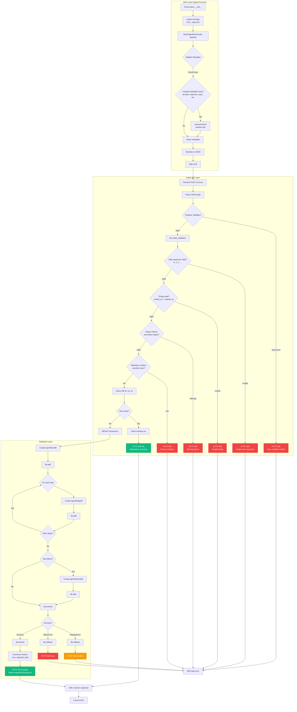
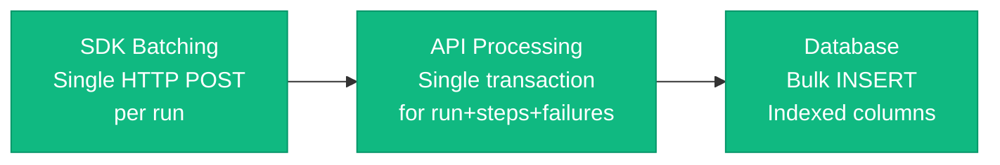
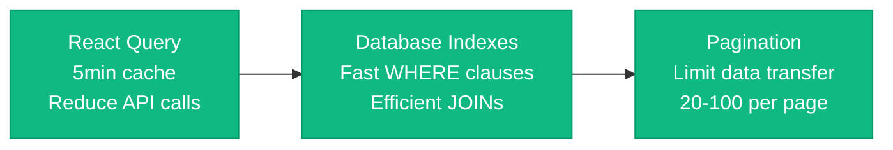

# Data Flow Documentation

This document describes how telemetry data flows through the Agent Observability Platform, from capture in the agent to visualization in the UI.

## Table of Contents
- [End-to-End Telemetry Flow](#end-to-end-telemetry-flow)
- [Ingest Pipeline (Write Path)](#ingest-pipeline-write-path)
- [Query Pipeline (Read Path)](#query-pipeline-read-path)
- [Privacy Enforcement](#privacy-enforcement)
- [Data Transformation](#data-transformation)

---

## End-to-End Telemetry Flow

Complete flow from agent execution to UI visualization.

```mermaid
flowchart TD
    Start([Agent Execution Starts]) --> InitTracer[Initialize AgentTracer]
    InitTracer --> StartRun[Start Run Context<br/>with tracer.start_run]

    StartRun --> CaptureStart[Capture started_at timestamp]
    CaptureStart --> ExecuteSteps{Execute Steps}

    ExecuteSteps -->|Each Step| StepStart[Step Context Enters<br/>with run.step]
    StepStart --> StepTiming[Capture started_at]
    StepTiming --> StepLogic[Execute Step Logic]
    StepLogic --> StepEnd[Step Context Exits]
    StepEnd --> StepCalc[Calculate latency_ms]
    StepCalc --> StepStore[Store step in run._steps]

    StepStore --> MoreSteps{More Steps?}
    MoreSteps -->|Yes| ExecuteSteps
    MoreSteps -->|No| RunEnd[Run Context Exits]

    RunEnd --> CaptureEnd[Capture ended_at timestamp]
    CaptureEnd --> BuildPayload[Build Run Payload]

    BuildPayload --> ValidateSDK{SDK Privacy<br/>Validation}
    ValidateSDK -->|Invalid| Sanitize[Sanitize/Remove<br/>Sensitive Data]
    ValidateSDK -->|Valid| SendAPI
    Sanitize --> SendAPI[POST /v1/runs to<br/>Ingest API]

    SendAPI --> ValidatePydantic{Pydantic Schema<br/>Validation}
    ValidatePydantic -->|Invalid| Reject[HTTP 400 Bad Request]
    ValidatePydantic -->|Valid| CheckDupe

    CheckDupe{Check run_id<br/>Exists?}
    CheckDupe -->|Exists| Return200[HTTP 200 OK<br/>Return existing run]
    CheckDupe -->|New| Transaction

    Transaction[Begin DB Transaction] --> InsertRun[INSERT agent_runs]
    InsertRun --> InsertSteps[INSERT agent_steps<br/>for each step]
    InsertSteps --> InsertFailures[INSERT agent_failures<br/>if present]
    InsertFailures --> Commit[COMMIT Transaction]
    Commit --> Return201[HTTP 201 Created]

    Return201 --> Stored[(Data Persisted<br/>in PostgreSQL)]

    Stored -.->|UI Polls| QueryAPI[GET /v1/runs]
    QueryAPI --> Filter[Apply Filters &<br/>Pagination]
    Filter --> QueryDB[SELECT FROM agent_runs<br/>JOIN steps, failures]
    QueryDB --> Serialize[Serialize to JSON<br/>via Pydantic]
    Serialize --> ReturnUI[Return to UI]
    ReturnUI --> Render[Render in Dashboard/<br/>Run Explorer]

    Render --> End([User Views Data])

    style Start fill:#10b981,stroke:#059669,color:#fff
    style Reject fill:#ef4444,stroke:#dc2626,color:#fff
    style Return200 fill:#f59e0b,stroke:#d97706,color:#fff
    style Return201 fill:#10b981,stroke:#059669,color:#fff
    style Stored fill:#3b82f6,stroke:#2563eb,color:#fff
    style End fill:#ec4899,stroke:#db2777,color:#fff
```



---

## Ingest Pipeline (Write Path)

Detailed flow of telemetry ingestion from SDK to database.



### Write Path Key Points

1. **Three Validation Layers:**
   - SDK: Basic privacy checks, client-side validation
   - Pydantic: Schema validation, type checking, business rules
   - Database: Constraints, foreign keys, uniqueness

2. **Idempotency:**
   - run_id is unique primary key
   - Duplicate POSTs return existing run (HTTP 200)
   - Prevents duplicate data from retries

3. **Atomicity:**
   - Single transaction for run + steps + failures
   - All-or-nothing commit
   - Rollback on any error

4. **Privacy Enforcement:**
   - Forbidden keys rejected at SDK level
   - Pydantic validators check metadata
   - No storage of prompts/responses/PII

---

## Query Pipeline (Read Path)

How data is retrieved and displayed in the UI.

```mermaid
flowchart TD
    subgraph UI["React UI"]
        UserAction([User Action]) --> UIRequest{Request Type}

        UIRequest -->|Dashboard| StatsReq[GET /v1/stats]
        UIRequest -->|Run List| RunsReq[GET /v1/runs<br/>with filters]
        UIRequest -->|Run Detail| DetailReq[GET /v1/runs/:id]

        StatsReq --> ReactQuery1[React Query<br/>useQuery hook]
        RunsReq --> ReactQuery2[React Query<br/>useQuery hook]
        DetailReq --> ReactQuery3[React Query<br/>useQuery hook]

        ReactQuery1 --> CheckCache1{Data in cache?}
        ReactQuery2 --> CheckCache2{Data in cache?}
        ReactQuery3 --> CheckCache3{Data in cache?}

        CheckCache1 -->|Fresh| ReturnCached1[Return cached data]
        CheckCache2 -->|Fresh| ReturnCached2[Return cached data]
        CheckCache3 -->|Fresh| ReturnCached3[Return cached data]

        CheckCache1 -->|Stale/Missing| Fetch1[axios.get]
        CheckCache2 -->|Stale/Missing| Fetch2[axios.get]
        CheckCache3 -->|Stale/Missing| Fetch3[axios.get]
    end

    subgraph QueryAPI["Query API"]
        Fetch1 --> StatsEndpoint[/v1/stats endpoint]
        Fetch2 --> RunsEndpoint[/v1/runs endpoint]
        Fetch3 --> DetailEndpoint[/v1/runs/:id endpoint]

        StatsEndpoint --> StatsQuery[Build stats queries]
        StatsQuery --> CountRuns[COUNT total runs]
        CountRuns --> CountFails[COUNT failures]
        CountFails --> CalcSuccess[Calculate success_rate]
        CalcSuccess --> AvgLatency[AVG latency from steps]
        AvgLatency --> GroupFails[GROUP BY failure_type, code]
        GroupFails --> GroupSteps[GROUP BY step_type]
        GroupSteps --> AggResult[Combine results]

        RunsEndpoint --> BuildQuery[Build base query]
        BuildQuery --> ApplyFilters{Apply Filters}
        ApplyFilters -->|agent_id| FilterAgent[WHERE agent_id = ?]
        ApplyFilters -->|status| FilterStatus[WHERE status = ?]
        ApplyFilters -->|environment| FilterEnv[WHERE environment = ?]
        ApplyFilters -->|time range| FilterTime[WHERE started_at BETWEEN ? AND ?]

        FilterAgent --> OrderBy[ORDER BY started_at DESC]
        FilterStatus --> OrderBy
        FilterEnv --> OrderBy
        FilterTime --> OrderBy

        OrderBy --> Paginate[OFFSET/LIMIT pagination]
        Paginate --> ExecuteQuery1[Execute query]

        DetailEndpoint --> QueryRun[SELECT FROM agent_runs<br/>WHERE run_id = ?]
        QueryRun --> EagerLoad[Eager load steps & failures]
        EagerLoad --> ExecuteQuery2[Execute with joins]
    end

    subgraph Database["PostgreSQL"]
        ExecuteQuery1 --> IndexScan1[Use indexes on<br/>agent_id, status, started_at]
        ExecuteQuery2 --> IndexScan2[Use index on run_id]
        AggResult --> AggQuery[Run aggregation queries]

        IndexScan1 --> ResultSet1[Return rows]
        IndexScan2 --> ResultSet2[Return run with<br/>steps & failures]
        AggQuery --> ResultSet3[Return aggregated data]
    end

    subgraph Serialization["Response Processing"]
        ResultSet1 --> SerializeRuns[Serialize to<br/>AgentRunResponse list]
        ResultSet2 --> SerializeDetail[Serialize to<br/>AgentRunResponse with<br/>nested steps/failures]
        ResultSet3 --> SerializeStats[Serialize to<br/>stats dictionary]

        SerializeRuns --> JSON1[Return JSON]
        SerializeDetail --> JSON2[Return JSON]
        SerializeStats --> JSON3[Return JSON]
    end

    JSON1 --> UIReceive1[UI receives response]
    JSON2 --> UIReceive2[UI receives response]
    JSON3 --> UIReceive3[UI receives response]
    ReturnCached1 --> UIReceive3
    ReturnCached2 --> UIReceive1
    ReturnCached3 --> UIReceive2

    UIReceive1 --> UpdateCache1[Update React Query cache]
    UIReceive2 --> UpdateCache2[Update React Query cache]
    UIReceive3 --> UpdateCache3[Update React Query cache]

    UpdateCache1 --> Render1[Render RunExplorer]
    UpdateCache2 --> Render2[Render RunDetail<br/>with Timeline & Failures]
    UpdateCache3 --> Render3[Render Dashboard<br/>with Stats]

    Render1 --> Display([User Sees Data])
    Render2 --> Display
    Render3 --> Display

    style Display fill:#ec4899,stroke:#db2777,color:#fff
    style ReturnCached1 fill:#f59e0b,stroke:#d97706,color:#fff
    style ReturnCached2 fill:#f59e0b,stroke:#d97706,color:#fff
    style ReturnCached3 fill:#f59e0b,stroke:#d97706,color:#fff
```

### Read Path Key Points

1. **Caching Strategy:**
   - React Query caches responses (5min stale time)
   - Reduces API calls for frequently accessed data
   - Background refetch on stale data

2. **Filtering:**
   - Multiple filters combinable (agent_id, status, environment, time)
   - Indexed columns ensure fast queries
   - Pagination prevents large data transfers

3. **Eager Loading:**
   - Detail view fetches run with all steps and failures in single query
   - Uses SQLAlchemy relationships
   - Prevents N+1 query problems

4. **Aggregation:**
   - Stats calculated via SQL GROUP BY
   - Efficient server-side computation
   - Returns summary data only

---

## Privacy Enforcement

Privacy validation happens at multiple layers to ensure no sensitive data is stored.

```mermaid
flowchart TD
    Start([Agent Captures Data]) --> Layer1

    subgraph Layer1["Layer 1: SDK Metadata Validation"]
        CheckKeys{Check metadata keys}
        CheckKeys -->|Contains forbidden?| Forbidden{Forbidden Keys:<br/>prompt, response,<br/>input, output,<br/>content, text}
        Forbidden -->|Yes| Warn[Log warning:<br/>Skipping metadata key]
        Forbidden -->|No| Allow1[Allow key]
        Warn --> FilterOut[Filter out key]
        Allow1 --> Pass1[Pass to Layer 2]
        FilterOut --> Pass1
    end

    subgraph Layer2["Layer 2: Pydantic Field Validators"]
        Pass1 --> ValidateFields[@field_validator]
        ValidateFields --> CheckMeta{Check metadata}
        CheckMeta -->|Forbidden key pattern| Raise1[raise ValueError<br/>Privacy violation]
        CheckMeta -->|Valid| CheckMsg{Check failure message}
        CheckMsg -->|Contains sensitive?| SensitivePatterns{Patterns:<br/>password, api_key,<br/>token, secret}
        SensitivePatterns -->|Match| Raise2[raise ValueError<br/>Sensitive data]
        SensitivePatterns -->|No match| Allow2[Allow through]
        CheckMeta -->|No metadata| Allow2
        Allow2 --> Pass2[Pass to Layer 3]
    end

    subgraph Layer3["Layer 3: Database Constraints"]
        Pass2 --> DBSchema{Database Schema}
        DBSchema --> NoTextColumns[No TEXT columns<br/>for prompts/responses]
        NoTextColumns --> JSONBOnly[Only JSONB for metadata<br/>Structured data only]
        JSONBOnly --> CheckConstraints[CHECK constraints<br/>on failure_code length]
        CheckConstraints --> Pass3[Data persisted]
    end

    Pass3 --> Safe([Data is Privacy-Safe])

    Raise1 --> Reject1[HTTP 400 Bad Request]
    Raise2 --> Reject2[HTTP 400 Bad Request]
    Reject1 --> Blocked([Data Blocked])
    Reject2 --> Blocked

    style Start fill:#10b981,stroke:#059669,color:#fff
    style Safe fill:#10b981,stroke:#059669,color:#fff
    style Blocked fill:#ef4444,stroke:#dc2626,color:#fff
    style Warn fill:#f59e0b,stroke:#d97706,color:#fff
    style Raise1 fill:#ef4444,stroke:#dc2626,color:#fff
    style Raise2 fill:#ef4444,stroke:#dc2626,color:#fff
```

### Privacy Rules

**Forbidden in Metadata:**
- `prompt`, `response`, `output`, `input`
- `content`, `text`, `message` (as keys)
- Any key containing above patterns

**Forbidden in Failure Messages:**
- `password`, `api_key`, `token`, `secret`
- PII patterns (basic detection in Phase 1)

**Allowed in Metadata:**
- Tool names (`"tool": "weather_api"`)
- HTTP status codes (`"http_status": 200`)
- Retry counts (`"attempt": 3`)
- Numeric metrics (`"result_count": 10`)
- Error codes (`"error_code": "TIMEOUT"`)

**Database Design:**
- No TEXT columns for free-form content
- Metadata stored as structured JSONB
- Length limits on failure_code (100 chars)
- Message limited to error descriptions only

---

## Data Transformation

How data is transformed as it flows through the system.

```mermaid
flowchart LR
    subgraph Agent["Agent Runtime"]
        Raw[Raw Step Execution<br/>• Function calls<br/>• Timing<br/>• Errors]
    end

    subgraph SDK["SDK Transform"]
        Raw --> StepCtx[StepContext<br/>• step_id UUID<br/>• seq number<br/>• started_at<br/>• ended_at<br/>• latency_ms]
        StepCtx --> RunCtx[RunContext<br/>• run_id UUID<br/>• steps list<br/>• failure object<br/>• status]
        RunCtx --> JSON1[JSON Payload<br/>AgentRunCreate]
    end

    subgraph API["API Transform"]
        JSON1 --> Pydantic[Pydantic Model<br/>• Validation<br/>• Type coercion<br/>• Field defaults]
        Pydantic --> ORM[SQLAlchemy ORM<br/>• AgentRunDB<br/>• AgentStepDB<br/>• AgentFailureDB]
    end

    subgraph DB["Database Storage"]
        ORM --> Tables[PostgreSQL Tables<br/>• agent_runs<br/>• agent_steps<br/>• agent_failures]
    end

    subgraph Query["Query Transform"]
        Tables --> ORMRead[SQLAlchemy Query<br/>• Relationships<br/>• Joins<br/>• Filters]
        ORMRead --> PydanticResp[Pydantic Response<br/>• AgentRunResponse<br/>• Nested steps<br/>• Nested failures]
        PydanticResp --> JSON2[JSON Response]
    end

    subgraph UIRender["UI Transform"]
        JSON2 --> React[React State<br/>• TypeScript types<br/>• Component props]
        React --> Rendered[Rendered UI<br/>• Tables<br/>• Charts<br/>• Timelines]
    end

    style Raw fill:#a855f7,stroke:#7c3aed,color:#fff
    style JSON1 fill:#3b82f6,stroke:#2563eb,color:#fff
    style Tables fill:#f59e0b,stroke:#d97706,color:#fff
    style JSON2 fill:#10b981,stroke:#059669,color:#fff
    style Rendered fill:#ec4899,stroke:#db2777,color:#fff
```



### Transformation Stages

1. **Capture (SDK):**
   - Python objects (datetime, UUID, dict)
   - Context manager timing
   - Step sequencing

2. **Serialization (SDK → API):**
   - Python dict → JSON
   - UUID → string
   - datetime → ISO 8601 string

3. **Validation (API):**
   - JSON → Pydantic model
   - Type coercion and validation
   - Business rule enforcement

4. **Persistence (API → DB):**
   - Pydantic → SQLAlchemy ORM
   - ORM → SQL INSERT
   - Relationships maintained

5. **Query (DB → API):**
   - SQL SELECT → ORM objects
   - Joins for relationships
   - ORM → Pydantic response

6. **Response (API → UI):**
   - Pydantic → JSON
   - JSON → HTTP response
   - Network transfer

7. **Rendering (UI):**
   - JSON → TypeScript types
   - React state management
   - Component rendering

---

## Performance Considerations

### Write Path Optimization



**Optimizations:**
- Single HTTP POST per run (not per step)
- Single database transaction
- Bulk INSERT for steps
- Indexed columns for duplicate check

**Target:** <200ms p99 for ingestion

### Read Path Optimization



**Optimizations:**
- Client-side caching (React Query)
- Database indexes on filtered columns
- Pagination to limit results
- Eager loading to prevent N+1 queries

**Target:** <500ms p99 for queries

---

## Next Steps

- Review [Failure Handling](./failure-handling.md) for failure capture flow
- See [API Sequences](./api-sequences.md) for detailed interaction diagrams
- Check [Component Responsibilities](./component-responsibility.md) for validation layer details
