# Failure Handling Documentation

This document describes how the AgentTracer Platform captures, classifies, and displays agent failures using a semantic taxonomy.

## Table of Contents
- [Failure Taxonomy](#failure-taxonomy)
- [Failure Capture Flow](#failure-capture-flow)
- [Retry Modeling](#retry-modeling)
- [Failure Query and Aggregation](#failure-query-and-aggregation)
- [Best Practices](#best-practices)

---

## Failure Taxonomy

Phase 1 uses a structured taxonomy with two levels: `failure_type` and `failure_code`.


### Taxonomy Levels

**Level 1: failure_type** (4 categories)
- `tool`: External API and tool call failures
- `model`: LLM provider and model failures
- `retrieval`: Knowledge base and vector DB failures
- `orchestration`: Workflow orchestration and logic failures

**Level 2: failure_code** (extensible codes)
- Specific failure reason within the type
- Examples: `timeout`, `rate_limit`, `no_results`, `max_retries_exceeded`
- Custom codes allowed for domain-specific failures

### Taxonomy Matrix

| Type | Code | When to Use | Example Message |
|------|------|-------------|-----------------|
| **tool** | `timeout` | API call exceeds timeout | "Weather API timeout after 30s" |
| **tool** | `invalid_response` | API returns malformed data | "API returned invalid JSON" |
| **tool** | `connection_error` | Network/connection failure | "Failed to connect to API" |
| **tool** | `api_error` | HTTP 4xx/5xx error | "API returned 503 Service Unavailable" |
| **tool** | `auth_error` | Authentication failure | "API key invalid or expired" |
| **model** | `rate_limit` | LLM provider rate limit | "OpenAI rate limit exceeded (429)" |
| **model** | `context_length_exceeded` | Prompt too long | "Prompt exceeds 128k token limit" |
| **model** | `invalid_output` | Malformed LLM response | "LLM returned invalid JSON" |
| **model** | `timeout` | LLM call timeout | "Model inference timeout" |
| **model** | `quota_exceeded` | Usage quota exceeded | "Monthly token quota exceeded" |
| **retrieval** | `no_results` | Empty search results | "Vector search returned 0 results" |
| **retrieval** | `connection_error` | DB connection failed | "Failed to connect to vector DB" |
| **retrieval** | `timeout` | Query timeout | "Vector search timeout after 10s" |
| **retrieval** | `invalid_query` | Malformed query | "Invalid semantic search query" |
| **orchestration** | `max_retries_exceeded` | Retry limit reached | "Failed after 3 retry attempts" |
| **orchestration** | `invalid_state` | Unexpected state | "Workflow in invalid state" |
| **orchestration** | `constraint_violation` | Business rule violated | "Cannot proceed: prerequisite missing" |
| **orchestration** | `uncaught_exception` | Unhandled error | "Unexpected error in workflow" |

---

## Failure Capture Flow

Complete flow from exception to database storage.

```mermaid
flowchart TD
    Start([Step Execution]) --> Execute{Execute Step Logic}

    Execute -->|Success| NoError[Step completes normally]
    Execute -->|Exception| Catch[try/except catches error]

    Catch --> Classify{Developer classifies<br/>failure type}

    Classify -->|Tool failure| ToolType[failure_type = 'tool']
    Classify -->|Model failure| ModelType[failure_type = 'model']
    Classify -->|Retrieval failure| RetrievalType[failure_type = 'retrieval']
    Classify -->|Orchestration| OrcheType[failure_type = 'orchestration']

    ToolType --> SelectCode1{Select<br/>failure_code}
    ModelType --> SelectCode2{Select<br/>failure_code}
    RetrievalType --> SelectCode3{Select<br/>failure_code}
    OrcheType --> SelectCode4{Select<br/>failure_code}

    SelectCode1 --> RecordFail[run.record_failure]
    SelectCode2 --> RecordFail
    SelectCode3 --> RecordFail
    SelectCode4 --> RecordFail

    RecordFail --> CreateFailObj[Create failure object<br/>• failure_type<br/>• failure_code<br/>• message<br/>• step_id optional]

    CreateFailObj --> ValidateMsg{Validate message<br/>for sensitive data}
    ValidateMsg -->|Contains sensitive| SanitizeMsg[Sanitize/reject<br/>password, api_key, token]
    ValidateMsg -->|Clean| StoreFailure

    SanitizeMsg --> StoreFailure[Store in run._failure]
    StoreFailure --> SetStatus[Set run.status = 'failure']
    SetStatus --> ExitRun[Run context exits]

    ExitRun --> SendAPI[Send to Ingest API<br/>with failure object]
    SendAPI --> ValidateAPI{API Validation}

    ValidateAPI -->|Invalid| Reject[HTTP 400 Bad Request]
    ValidateAPI -->|Valid| InsertDB[INSERT INTO agent_failures<br/>• run_id<br/>• step_id<br/>• failure_type<br/>• failure_code<br/>• message]

    InsertDB --> LinkRun[Foreign key links<br/>to agent_runs table]
    LinkRun --> LinkStep[Foreign key links<br/>to agent_steps table<br/>if step_id provided]

    LinkStep --> Stored[(Failure persisted<br/>in database)]

    Stored --> Queryable[Queryable via<br/>GET /v1/runs/:id<br/>GET /v1/stats]

    NoError --> Success([Step completes<br/>no failure recorded])

    style Start fill:#10b981,stroke:#059669,color:#fff
    style Catch fill:#f59e0b,stroke:#d97706,color:#fff
    style RecordFail fill:#ef4444,stroke:#dc2626,color:#fff
    style Stored fill:#3b82f6,stroke:#2563eb,color:#fff
    style Reject fill:#ef4444,stroke:#dc2626,color:#fff
    style Success fill:#10b981,stroke:#059669,color:#fff
```



### Code Example: Recording Failures

```python
from sdk.agenttrace import AgentTracer

tracer = AgentTracer(agent_id="my_agent", agent_version="1.0.0")

with tracer.start_run() as run:
    # Planning step
    with run.step("plan", "analyze_query"):
        query = parse_user_input()

    # Tool call that might fail
    try:
        with run.step("tool", "call_weather_api") as step:
            response = requests.get(weather_api, timeout=30)
            response.raise_for_status()
            data = response.json()
    except requests.Timeout:
        # Classify as tool/timeout failure
        run.record_failure(
            failure_type="tool",
            failure_code="timeout",
            message="Weather API call timeout after 30 seconds"
        )
        return  # Exit run with failure status
    except requests.HTTPError as e:
        # Classify as tool/api_error failure
        run.record_failure(
            failure_type="tool",
            failure_code="api_error",
            message=f"Weather API returned {e.response.status_code}"
        )
        return

    # Continue with successful response...
    with run.step("respond", "generate_response"):
        answer = generate_answer(data)
```

### Failure Object Structure

**In SDK:**
```python
{
    "step_id": uuid4(),  # Optional: which step failed
    "failure_type": "tool",
    "failure_code": "timeout",
    "message": "Weather API call timeout after 30 seconds"
}
```

**In Database:**
```sql
INSERT INTO agent_failures (
    failure_id,
    run_id,
    step_id,
    failure_type,
    failure_code,
    message,
    created_at
) VALUES (
    '123e4567-e89b-12d3-a456-426614174000',
    'run-uuid',
    'step-uuid',
    'tool',
    'timeout',
    'Weather API call timeout after 30 seconds',
    NOW()
);
```

---

## Retry Modeling

Phase 1 models retries as **separate step spans**, not as attributes on a single step.


### Retry Code Example

```python
max_retries = 3
for attempt in range(max_retries):
    try:
        # Each retry is a separate step span
        with run.step("tool", f"api_call_attempt_{attempt+1}") as step:
            step.add_metadata({"attempt": attempt + 1})
            result = call_external_api()
            break  # Success, exit loop
    except Exception as e:
        if attempt == max_retries - 1:
            # Final attempt failed
            run.record_failure(
                failure_type="tool",
                failure_code="timeout",
                message=f"API failed after {max_retries} attempts"
            )
            run.status = "failure"
        # Continue to next retry
```

### Why Separate Steps for Retries?

**Benefits:**
1. **Timeline Reconstruction**: UI can show exact retry sequence
2. **Latency Tracking**: Each attempt's latency is captured individually
3. **Retry Pattern Analysis**: Identify which retries typically succeed
4. **Simplicity**: No complex retry metadata, just ordered steps

**Database Representation:**
```
Run: customer_support_agent_run_123
  Step 0: tool/api_call_attempt_1 (latency: 100ms) ❌
  Step 1: tool/api_call_attempt_2 (latency: 120ms) ❌
  Step 2: tool/api_call_attempt_3 (latency: 95ms) ✅
  Step 3: respond/generate_response (latency: 150ms) ✅
Status: partial (some failures, but eventually succeeded)
```

### Run Status After Retries

| Scenario | Status | Failure Object | Description |
|----------|--------|----------------|-------------|
| All retries fail | `failure` | Yes, with last error | Complete failure |
| Eventually succeeds | `partial` | No | Succeeded after retries |
| First attempt works | `success` | No | No retries needed |

---

## Failure Query and Aggregation

How failures are queried and aggregated for the UI.

```mermaid
flowchart TD
    subgraph UI["UI Components"]
        Dashboard[Dashboard] -->|GET /v1/stats| StatsReq
        RunDetail[Run Detail Page] -->|GET /v1/runs/:id| DetailReq
        FailureBreakdown[Failure Breakdown<br/>Component] -->|Render from stats| Display
    end

    subgraph QueryAPI["Query API"]
        StatsReq[GET /v1/stats endpoint] --> BuildStats[Build statistics query]
        DetailReq[GET /v1/runs/:id endpoint] --> FetchRun[Fetch run with failures]

        BuildStats --> CountTotal[COUNT total runs]
        CountTotal --> CountFailed[COUNT runs<br/>WHERE status = 'failure']
        CountFailed --> CalcSuccess[success_rate =<br/>total - failures / total * 100]

        CalcSuccess --> GroupFailures[GROUP BY<br/>failure_type, failure_code]
        GroupFailures --> FailureQuery[SELECT failure_type,<br/>failure_code,<br/>COUNT<br/>FROM agent_failures<br/>WHERE run_id IN runs]

        FetchRun --> JoinFailures[SELECT * FROM agent_runs<br/>LEFT JOIN agent_failures<br/>WHERE run_id = ?]
    end

    subgraph Database["PostgreSQL"]
        FailureQuery --> FailureTable[(agent_failures table)]
        JoinFailures --> Tables[(agent_runs +<br/>agent_failures)]

        FailureTable --> Results1[Return breakdown:<br/>tool/timeout: 5<br/>model/rate_limit: 2<br/>retrieval/no_results: 3]

        Tables --> Results2[Return run with<br/>failures array]
    end

    Results1 --> Serialize1[Serialize to JSON:<br/>failure_breakdown: &#123;<br/>  'tool/timeout': 5,<br/>  'model/rate_limit': 2<br/>&#125;]

    Results2 --> Serialize2[Serialize to JSON:<br/>failures: [<br/>  &#123;type, code, message&#125;<br/>]]

    Serialize1 --> ReturnStats[Return stats to UI]
    Serialize2 --> ReturnDetail[Return run to UI]

    ReturnStats --> Display[Render charts &<br/>failure breakdown]
    ReturnDetail --> DisplayDetail[Render failure<br/>classification card]

    style Dashboard fill:#ec4899,stroke:#db2777,color:#fff
    style Display fill:#10b981,stroke:#059669,color:#fff
    style Results1 fill:#3b82f6,stroke:#2563eb,color:#fff
    style Results2 fill:#3b82f6,stroke:#2563eb,color:#fff
```

### Aggregation Query Example

```sql
-- Failure breakdown by type/code
SELECT
    failure_type,
    failure_code,
    COUNT(*) as count
FROM agent_failures
WHERE run_id IN (
    SELECT run_id FROM agent_runs
    WHERE agent_id = 'customer_support_agent'
    AND started_at >= NOW() - INTERVAL '7 days'
)
GROUP BY failure_type, failure_code
ORDER BY count DESC;

-- Result:
-- tool/timeout          | 15
-- model/rate_limit      | 8
-- retrieval/no_results  | 5
-- orchestration/max_retries_exceeded | 3
```

### UI Display

**Dashboard Stats:**
```json
{
  "total_runs": 100,
  "total_failures": 25,
  "success_rate": 75.0,
  "failure_breakdown": {
    "tool/timeout": 15,
    "model/rate_limit": 8,
    "retrieval/no_results": 5,
    "orchestration/max_retries_exceeded": 3
  }
}
```

**Failure Breakdown Component:**
```
┌─────────────────────────────────────────┐
│ Failure Breakdown (Last 7 Days)        │
├─────────────────────────────────────────┤
│ 🔴 Tool Failures (15)                   │
│   • timeout: 15 occurrences             │
│                                         │
│ 🟠 Model Failures (8)                   │
│   • rate_limit: 8 occurrences           │
│                                         │
│ 🔵 Retrieval Failures (5)               │
│   • no_results: 5 occurrences           │
│                                         │
│ 🟣 Orchestration Failures (3)           │
│   • max_retries_exceeded: 3 occurrences │
└─────────────────────────────────────────┘
```

---

## Best Practices

### 1. Classification Guidelines

**Always classify at the right type:**
- If external API fails → `tool`
- If LLM provider fails → `model`
- If vector/knowledge DB fails → `retrieval`
- If workflow logic fails → `orchestration`

**Choose specific codes:**
- Use specific codes like `timeout` over generic `error`
- Use `rate_limit` over `api_error` when appropriate
- Create custom codes for domain-specific failures

### 2. Message Writing

**Good failure messages:**
```python
# ✅ Clear, no PII, actionable
"Weather API timeout after 30 seconds"
"OpenAI rate limit exceeded (429)"
"Vector search returned 0 results for query"
"Maximum retry attempts (3) exceeded"
```

**Bad failure messages:**
```python
# ❌ Contains sensitive data
"API call failed with user query: 'show me John's data'"
"Token abc123xyz expired"

# ❌ Too vague
"Error occurred"
"Something went wrong"

# ❌ Too verbose
"The weather API endpoint located at https://api.weather.com..."
```

### 3. Step Linkage

**Link failures to steps when possible:**
```python
try:
    with run.step("tool", "fetch_data") as step:
        data = api_call()
except Exception as e:
    # Good: Links failure to the specific step that failed
    run.record_failure(
        failure_type="tool",
        failure_code="timeout",
        message="API timeout",
        step_id=step.step_id  # ✅ Explicit linkage
    )
```

### 4. Retry Strategy

**Model retries correctly:**
```python
# ✅ Each retry as separate step
for attempt in range(3):
    with run.step("tool", f"api_call_attempt_{attempt+1}"):
        try:
            result = api_call()
            break
        except Exception:
            if attempt == 2:  # Last attempt
                run.record_failure(...)
```

**Not like this:**
```python
# ❌ Single step with retry metadata
with run.step("tool", "api_call") as step:
    for attempt in range(3):
        try:
            result = api_call()
            step.add_metadata({"retries": attempt})  # ❌ Hidden retries
            break
        except Exception:
            continue
```

### 5. Status Setting

**Set run status appropriately:**
```python
# Complete failure
run.record_failure(...)
run.status = "failure"  # Explicit

# Partial success (retries eventually worked)
# Some steps failed but overall succeeded
run.status = "partial"

# Complete success
# Default, no need to set explicitly
# run.status = "success"
```

---

## Failure Analysis Capabilities

With this taxonomy, you can answer:

**Operational Questions:**
- What's our top failure type? (tool, model, retrieval, orchestration)
- Which specific failures are most common? (timeout, rate_limit, no_results)
- What's the failure rate over time?
- Which agents have the highest failure rate?

**Debugging Questions:**
- What step typically fails in this agent?
- Are failures correlated with specific environments?
- Do retries usually succeed, or do they always fail?
- What's the average latency before a timeout failure?

**Product Questions:**
- Should we increase API timeouts?
- Do we need higher rate limits?
- Are retrieval results too sparse (no_results)?
- Is our orchestration logic too fragile?

---

## Next Steps

- Review [API Sequences](./api-sequences.md) for failure ingestion flow
- See [Data Flow](./data-flow.md) for privacy validation in failure messages
- Check examples in `examples/agent_with_failures.py` for comprehensive failure scenarios
